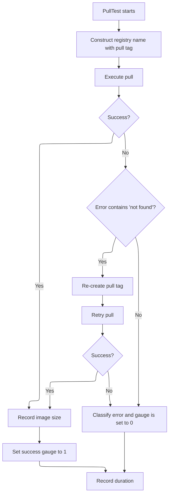
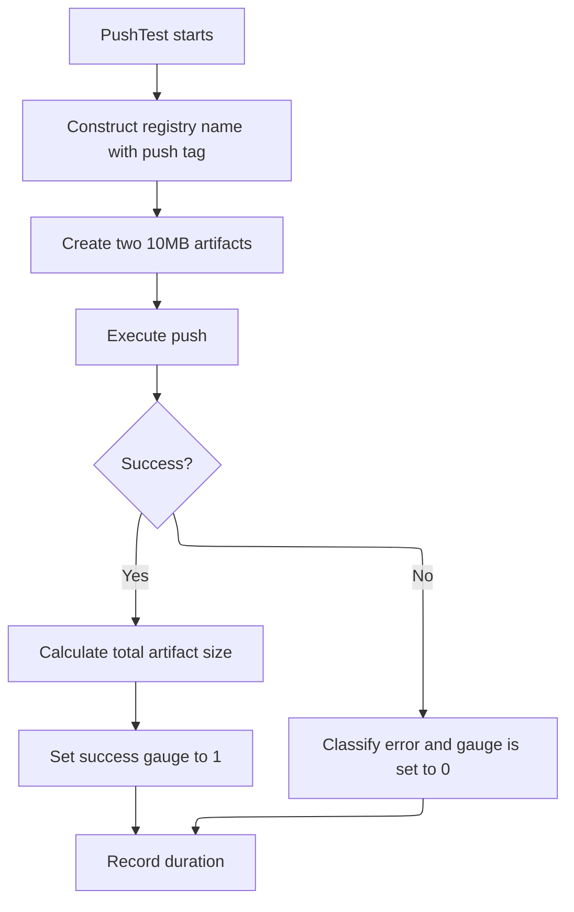
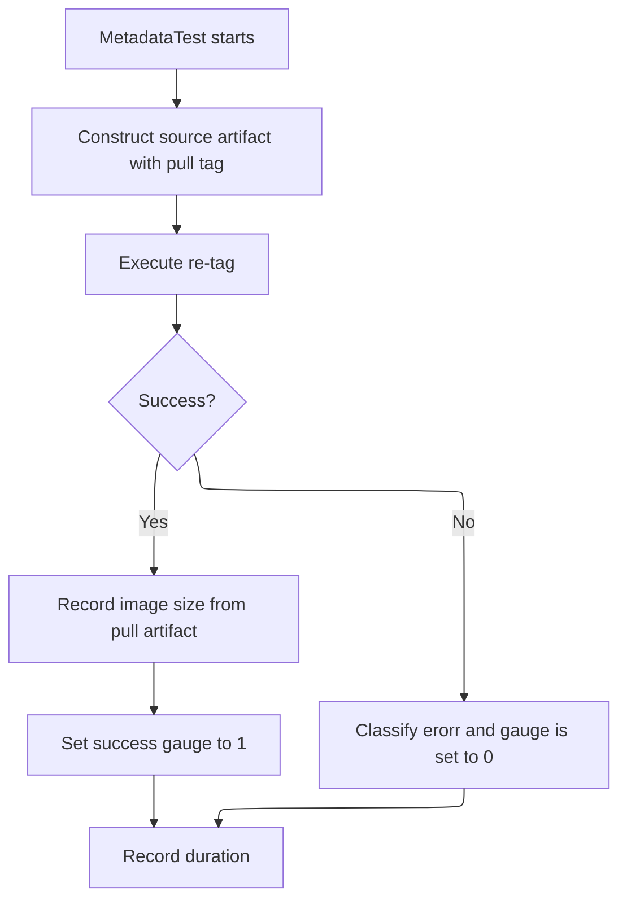
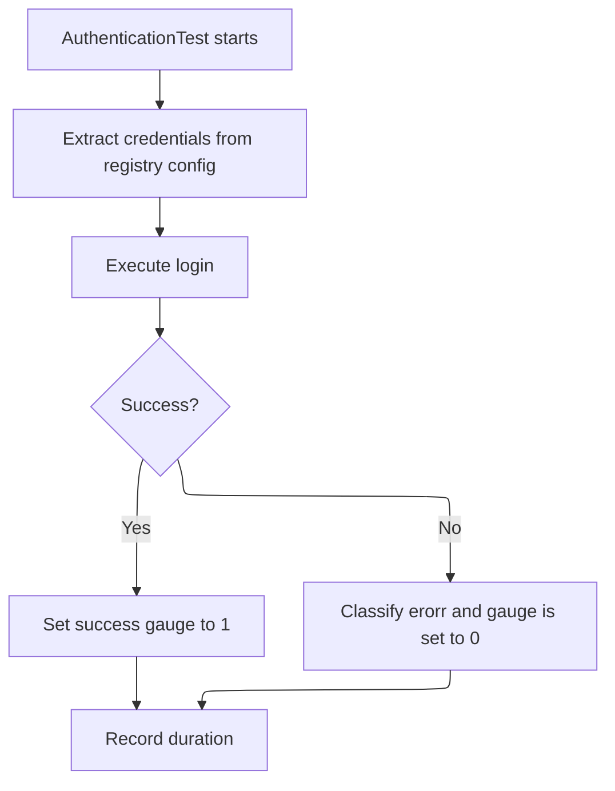

# Registry Exporter

Deployed as component in [infra-deployments](https://github.com/redhat-appstudio/infra-deployments/tree/main/components/monitoring/registry).

The Registry Exporter is a Prometheus exporter that periodically monitors the health and performance of container registries used in Konflux (such as Quay.io) by continuously performing pull, push, metadata (tag), and authentication operations. It uses the `oras` CLI tool to interact with OCI-compliant registries and exposes comprehensive metrics about operation success, failures, durations, and sizes.

After the exporter is terminated, cleanup is executed to delete the _unique_ tags belonging to the pod.

## Metrics Exposed

The exporter exposes the following unified Prometheus metrics for all test types (pull, push, metadata, authentication):

### Names
- `registry_exporter_success`: Gauge indicating if a last test was successful (1 if successful, 0 otherwise)
- `registry_exporter_error_count`: Counter for total number of errors encountered during tests for correlation with failures
- `registry_exporter_duration_seconds`: Histogram of durations of operations in seconds
- `registry_exporter_image_size_mbytes`: Gauge of artifact (image) size from the registry in megabytes (only for pull and push tests)

### Labels

All metrics include the following labels:
- `tested_registry`: Identifies the registry type being tested (e.g., "quay.io")
- `node`: The Kubernetes node name where the exporter is running
- `type`: The test type being performed, one of:
  - `pull`: Pull operation test
  - `push`: Push operation test
  - `metadata`: Metadata (tag) operation test
  - `authentication`: Authentication operation test

Error count metrics additionally include an `error` label with one of the following error types:
- `TIMEOUT`: Commands that didn't finish within the `commandTimeout` window.
- `INVALID_REQUEST`: Malformed request (400, bad request)
- `AUTHENTICATION`: Authentication/authorization issues (401, 403, unauthorized)
- `NOT_FOUND`: Tag not found (404, not found)
- `SERVER_ERROR`: Server-side errors (500, 502, 503, 504)
- `UNKNOWN`: Other errors

### Configuration

- **Scrape Interval**: `5 * time.Minute` (configurable via `scrapeInterval` constant)
- **Max Retries**: `5` attempts per operation with exponential backoff (configurable via `maxRetries` constant)
- **Timeout**: `35 * time.Seconds` How much time before the executed command would timeout (configurable via `commandTimeout`)
- **Metrics Endpoint**: `:9101/metrics`
- **Artifact Size**: `10MB` per artifact (configurable via `targetFileSize` constant)
- **Required Environment Variables**:
  - `QUAY_URL`: The registry URL to test against
  - `DOCKER_CONFIG`: Path to directory containing `config.json` with registry credentials
  - `NODE_NAME`: Name of the node to distinguish alerts in the cluster

## Test Operations

As apperent from the metrics exporter performs four types of tests per scrape interval:

1. **Pull Test**: Pulls an artifact from the registry using the `:pull` tag
2. **Push Test**: Creates two 10MB artifacts and pushes them to `:push-{HOSTNAME}`
3. **Metadata Test**: Creates a new tag from the pull tag to `:metadata-{HOSTNAME}`
4. **Authentication Test**: Tests authentication by performing a login operation

## Flow Diagrams

### Pull Test Flow

### Push Test Flow

### Metadata Test Flow

### Authentication Test Flow

## Development

### Local deployment

#### Manual
The exporter can be run with the following commands:

1. Generate the docker config.json file with secret token and store it in `${PATH_TO_CONFIG}`
1. Set the url to the registry in `${QUAY_URL}`
1. Setup a test directory `${PATH_TO_TEST_DIR}` 
1. Build the exporter image locally by running:
    - `podman build . -t quay-exporter`
1. Run the image locally
    - `podman run -it -p 9101:9101 -e=DOCKER_CONFIG="/.docker/" -e=QUAY_URL=${QUAY_URL} -e=NODE_NAME="test_node" -v ${PATH_TO_CONFIG}:/.docker/config.json -v ${PATH_TO_TEST_DIR}:/mnt/storage localhost/quay-exporter registryexporter`
